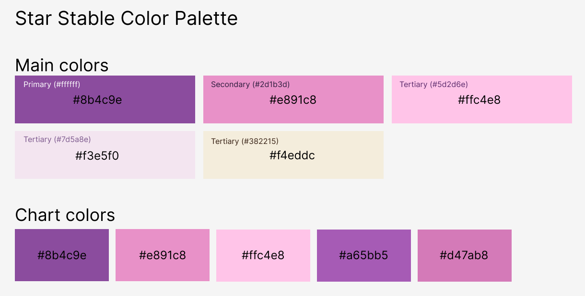

# Inspiratie huisstijl website
Huisstijl van Star Stable - <a href="https://www.starstable.com/nl">

Van de website een kleuren palet gemaakt

# Bronnenlijst
Star Stable(2011). Geraadpleegd op 04-05-2026 van  <a href="https://www.starstable.com/nl">

Figma(2012). Geraadpleegd op 04-05-2026 van <a href="https://www.figma.com/">

Code uit vorige projecten kunnen toepassen.
Voor ease wel chatgpt
Rem grootte gok ik tot het er goed uit ziet
nth-of-type of nth-of-child chatgpt

https://codepen.io/shooft/pen/GRbxLYV

https://heroicons.com/

Foto's: https://stock.adobe.com/nl/search?filters%5Bcontent_type%3Aphoto%5D=1&filters%5Bcontent_type%3Aillustration%5D=1&filters%5Bcontent_type%3Azip_vector%5D=1&filters%5Bcontent_type%3Avideo%5D=1&filters%5Bcontent_type%3Atemplate%5D=1&filters%5Bcontent_type%3A3d%5D=1&filters%5Bcontent_type%3Aaudio%5D=0&filters%5Binclude_stock_enterprise%5D=0&filters%5Bis_editorial%5D=0&filters%5Bcontent_type%3Aimage%5D=1&filters%5Bfree_collection%5D=0&k=learning&order=relevance&search_page=1&search_type=usertyped&acp=&aco=learning&get_facets=0

Peter Paul Koch:
https://www.quirksmode.org/about/
https://www.linkedin.com/in/peter-paul-koch-b0b9/?isSelfProfile=false
https://beyondtellerrand.com/speakers/peter-paul-koch